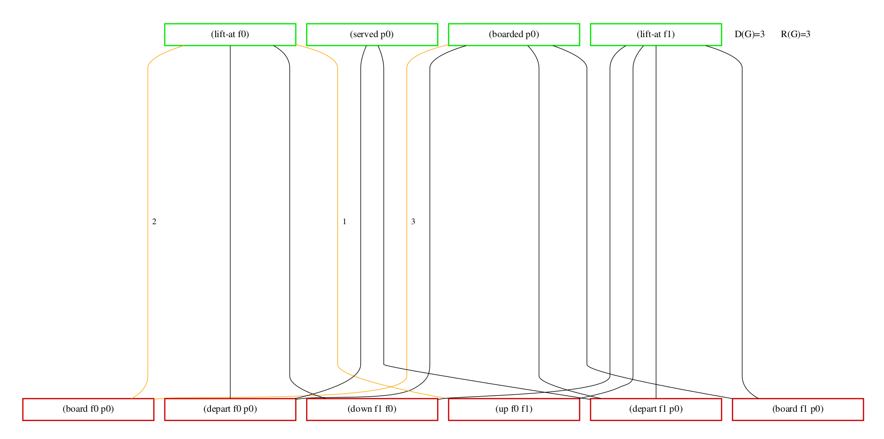
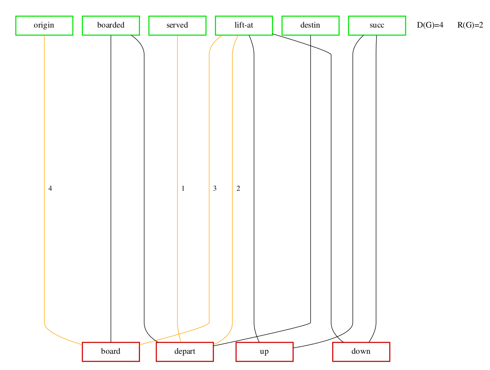
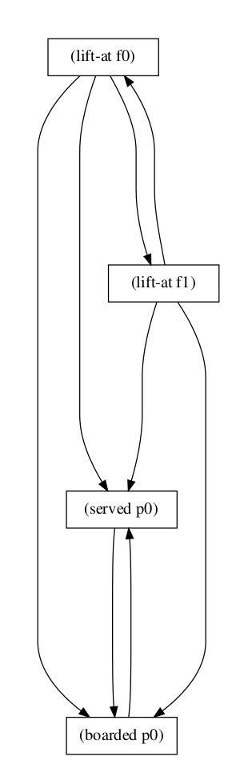

# PDDLtoGraph

PDDLtoGraph is a simple program for visualising PDDL files as 
relatedness and causal graphs, written in python. 
It also determines the diameter and the radius of the graph.

## Requirements
Make sure the following program and packages are installed:

+ python3
+ pip3
+ [networkx](https://networkx.github.io/)
+ [pygraphviz](https://pygraphviz.github.io/)
+ [pydot](https://github.com/pydot/pydot)

````
sudo apt install python3
sudo apt install python3-pip
pip3 install networkx
pip3 install pygraphviz
pip3 install pydot
````

[Pyperplan](https://bitbucket.org/malte/pyperplan/src) is used
for grounding, but is already included inside the repository.

## Usage
The programm can be started by running **ptg.py**. It has 
requires two arguments; a PDDL domain file and a PDDL problem description.
````
python3 ptg.py DOMAIN PROBLEM
````

Optional arguments can also be invoked:

+ ````-h, --help````:  shows the help message
+ ````-l, --loglevel````:  pyperplan log level
  + available levels are: ````{debug,info,warning,error}```` 
+ ````-g, --graphtype````:  choose between the graph types
  + available types are: ````{relatedness,causal,rel_simple}```` 
  + ````relatedness````: factored problem
  + ````rel_simple````: lifted problem. Only works with new grounding
+ ````--grounding````:  select wich grounding method is chosen
  + ````original````: pyperplans original grounding
  + ````new````: slightly modified version, without pruning
+ ````-d, --diameter````:  toggle the drawing of diameter length path
  + available options are: ````{true, false}```` 

#### Example
You can try it out with the two provided example files to create
a relatedness graph on an elevator problem task.
````
python3 ptg.py -g relatedness -d false example/domain.pddl example/f2p1.pddl
````

## Graph Examples
#### Relatedness Graph

#### Simplified Relatedness Graph

#### Causal Graph

